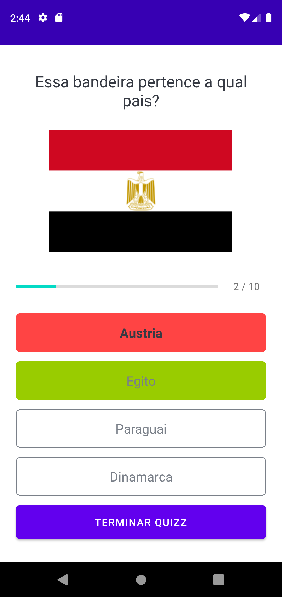

# Quizz
Quizz app built entirely in Kotlin code, with three steps:

<ol type="1">
  <li>Home page -> enter your name -> initializes the quizz</li>
  <li>Quizz</li>
  <li>Finish page, shows score -> return to home page</li>
</ol>

# Requirements 
* Android Studio
* Android device or emulator

# Output example 

